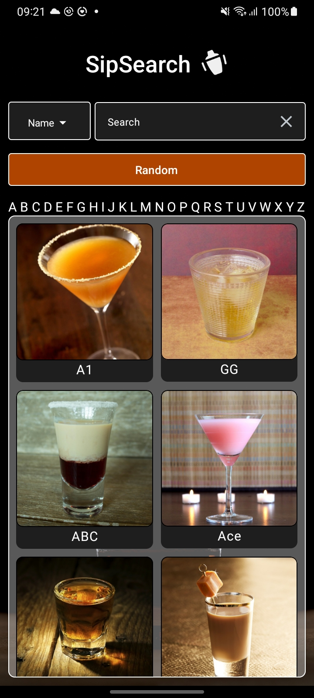
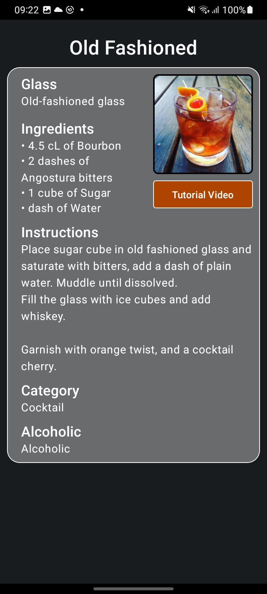

# SipSearch

The purpose of this application is to allow users to search for cocktails by their name or ingredient and view the recipe and instructions on how to prepare the drink. 
The application also has the functionality to get a random cocktail or browse the available cocktails by the first letter of the cocktail name.

I chose this project to practice and deepen my understanding of how to make HTTP request using retrofit and how to create basic UI designs using jetpack compose..

# Application View

# Project specifications
- Kotlin
- Retrofit
- MVVM
- Jetpack Compose
- Coil
